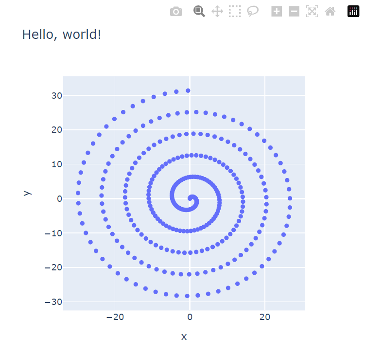

# JSON Viewer

> Motivation: Open file into a custom data visualization

This repository is a recipe for custom behavior when launching files. A python script may be set up for default execution of a file extension, for example JSON.

## Files

- `json_viewer.py`: Example JSON visualization via Plotly.
- `launcher.bat`: Batch file to launch files through the json_viewer.py script.

## Example outcome

